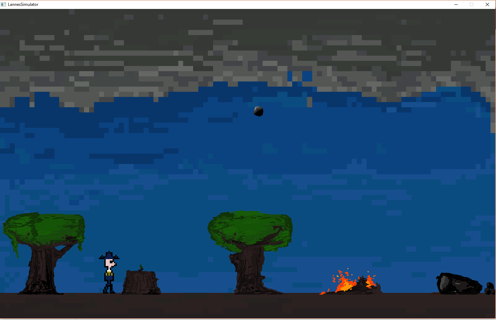

# MarshalJeanLannesSim
simulator of revolutionary/napoleonic frances great marshal: jean lannes

TODO:
-add a health bar

-because the quadratic formula maps from top right of the screen to the player, the ball travels much too fast when the player is by the right edge of the screen... find a solution to that

-add an end game boss fight?

Jean Lannes died in 1809 after the Battle of Aspern-Essling. He witnessed his friend get decapitated by a cannonball, and after sitting down to mourn his loss, was hit by a cannonball himself. 

This simulator sets the player as Jean Lannes, and the main goal is to dodge cannonballs. All sprites are drawn by me using Piskel.

thanks a TON to LazyFoo.net for their tutorials on SDL as well as MakeFiles, without them I probably would have used PyGame LOL

thanks to haoda for inspiring me to make a game

thanks to mathieu for helping me debug the cannonball algorithm :) and also letting me work on his game as well
